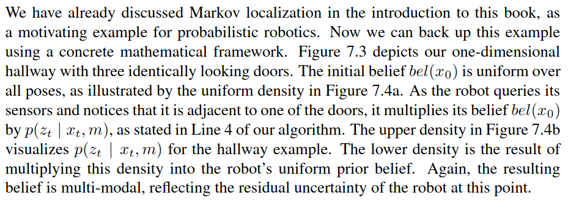

# Machnine Learning module BHT for learning purposes
# Literatur
[Probabilistic Robotics](https://docs.ufpr.br/~danielsantos/ProbabilisticRobotics.pdf)
# Themen
## SLAM
V-SLAM  
keine Stereo Kamera  
Aus RGB Daten Depth Image!

### Verisons
grid-based  
landmark-based  

Pfade - Integrale
Graphen based SLAM - Optimierung von Graphen

### Localization
uniform distirbution -> np.random.uniform  
t0 Belief -> uniform distiŕibution **prior**  
messen  
t1 **posterior** -> correction step  
bewegen - **Motion model**  
t2 prediction step  
messen ...  
### Motion Model

### Observation Model

# Axiome
- Sicheres Ereignis P = 1
- Unmögliches Ereigniss P = 0
- Summe aller Wahrscheinlichkeiten = 1
- Additionstheorem  
$$p(x \lor y) = p(x) + p(y) - p(x \land y) => p(x,y)$$
ODER
$$p(x \lor y) = p(x \land y) = 0$$
$$p(\lnot x) = 1 - p(x)$$
- Produktregel  
wahrscheinlichkeit x unter Bedingung, dass yi eingetreten ist  (Wahrscheinlichkeitbaum)  
$$p(x, yi) = p(x | y) * p(yi) = p(yi | x) * p(x)$$
- Bayes Rule  
$$p(x | y) =\frac{p(x | y) * p(x)}{p(y)}$$
p(x|y) -> posterior  
p(y|x) -> Likelyhood (Messung)  
p(x) -> prior  
p(y) -> Evidence (Normierung)  

- Satz der totalen Wahrscheinlichkeit  
gesamt wahrscheinlichkeit ist die Summer aller vorherigen Wahrscheinlichkeiten (bsp. Lokalisierung )  
$$p(x) = \sum(p(x,yi)) = \sum(p(x|yi) * p(yi))$$
